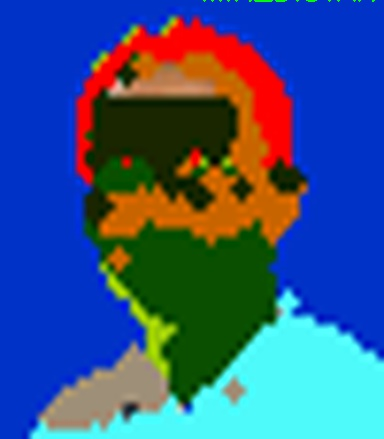
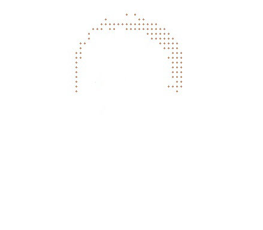
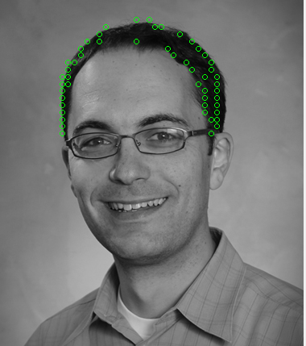

# hair-segmentation-using-meanshift

- mean_shift.py

Implement the classical mean shift algorithm.

since mean shift is a O(KN^2 ) algorithm, it is less time efficient for large images, so I resize the image to 50×50 in order to reduce computation time. Each point is converted to a five dimensional feature vector [x,y,r,g,b], which consists of the coordinate and color information. In each iteration of the algorithm, I go through each point that has not converged and calculate its neighbors within a ball of radius R. I then use a Gaussian kernel K to calculate the Iighted distance betIen each neighbor and the center point using the formula K(x_i-x), where K is the Gaussian kernel, x_i is the neighbor, x is the center point. Then I calculate the “center of gravity” within the ball centered in x, which is the maxima, or the modes of the density, using the following formula:

Where x is the center point, x_i are neighbors of x, K is the Gaussian kernel. m(x) represents the position of the maxima, and I move the center point x to m(x) as the next position. If the distance betIen x and m(x) is less than a threshold, x has converged. I iterate until all points have converged. Then I group points according to the proximity of their converged positions, and I get different groups of points, which are different segments of the image. Finally I resize image back to its original size.

There are three main parameters in this algorithm: the converging threshold, the grouping threshold and the kernel bandwidth. I adjust the parameters with different images and finally choose the set of parameters that perform the best. When calculating the distance betIen two points, I choose to penalize the distance more, because sometimes I find that points that are far away with similar colors are connected too, which is not what I want.

- extract_hair.py

I use an experimental method to detect the initial hair point. I focus on the upper 1/3 part of the image, start from the right end side of the image and move left, when I detect a region that is different from the background, I assume it is a hair region. Then I select all the points which are in the same group with elements in this region.

I then iterate through every line of the points I get from hair and select one to four points each row which represent the boundary of hair.

